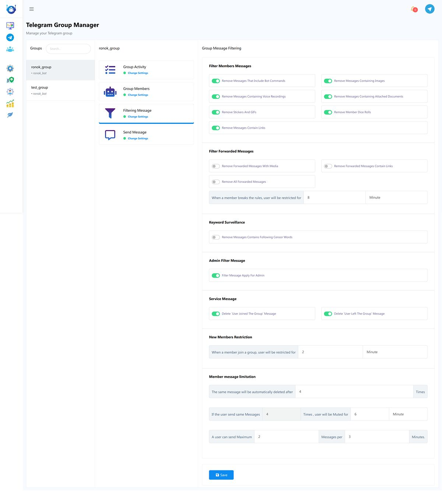
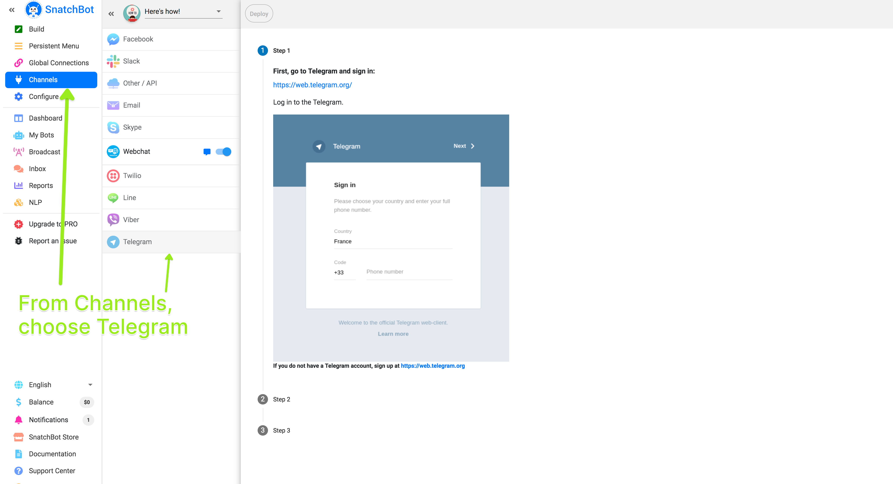
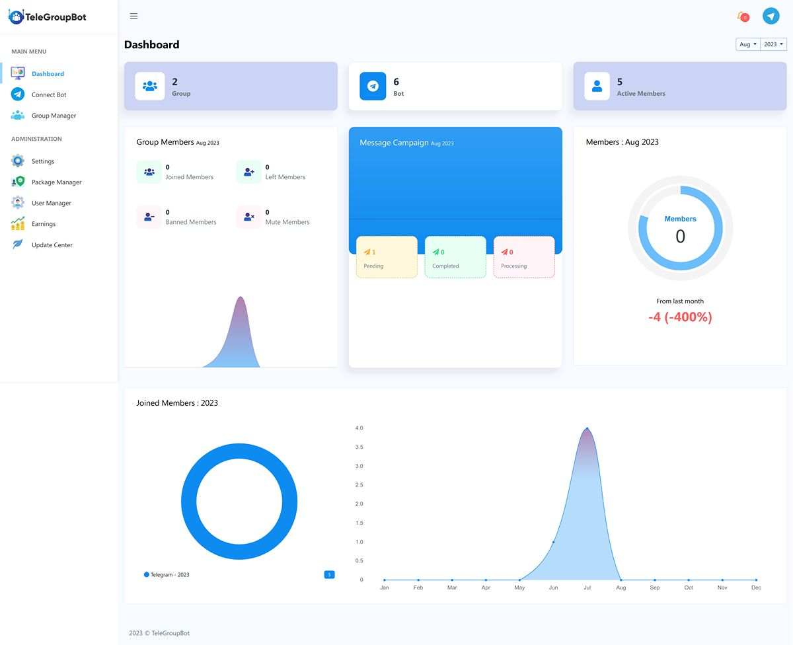
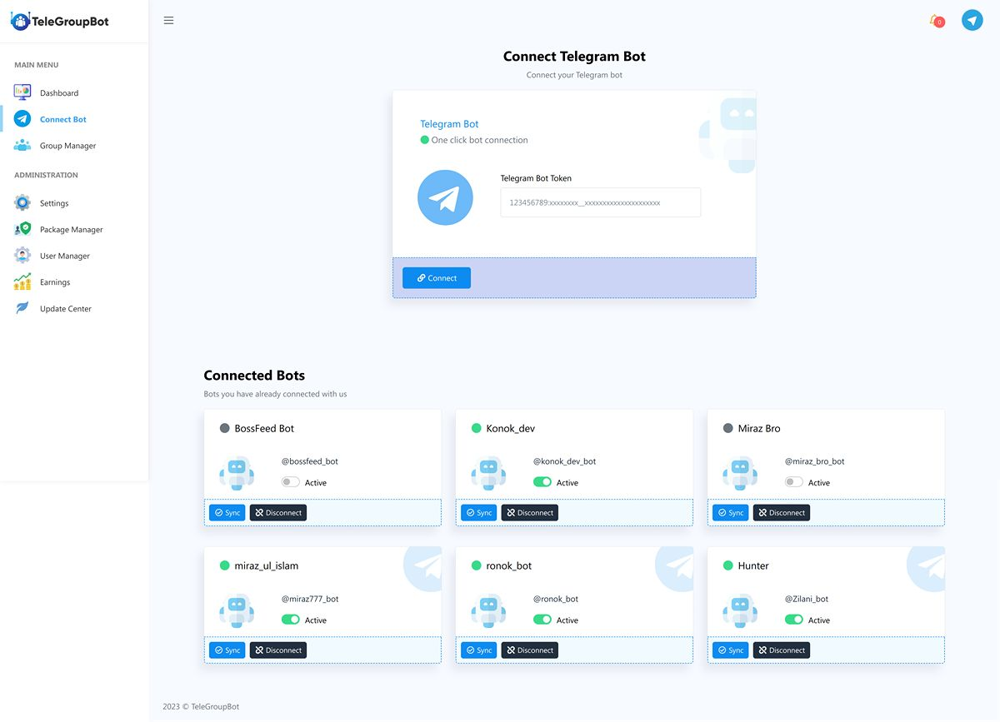
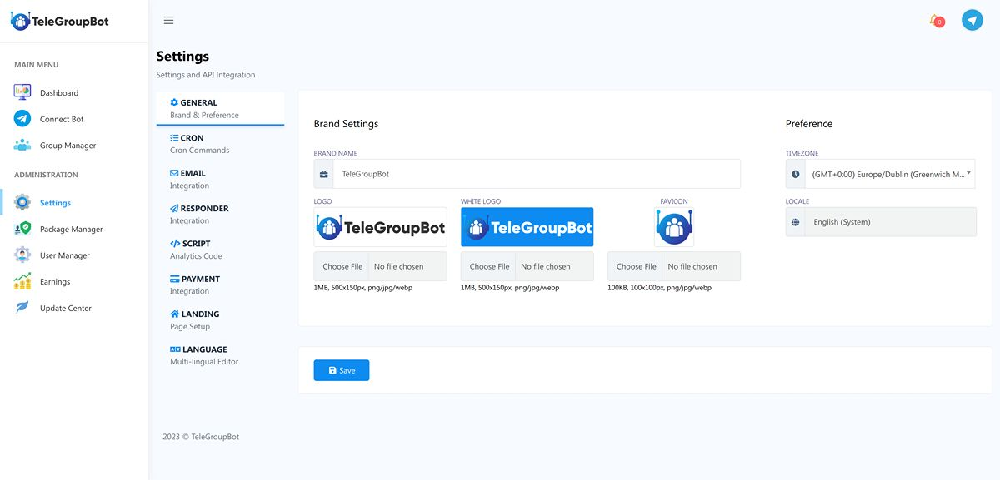

# Laravel Management Telegram Bot

This project is a Laravel-based application for managing Telegram groups using the TeleGroupBot software.

## Requirements

- PHP >= 7.3
- MySQL >= 5.7
- Composer
- Node.js and npm (for frontend assets)

## Installation

1. Clone the repository:
    ```sh
    git clone https://github.com/yourusername/laravel-management-telegram-bot.git
    cd laravel-management-telegram-bot
    ```

2. Install PHP dependencies:
    ```sh
    composer install
    ```

3. Install Node.js dependencies:
    ```sh
    npm install
    ```

4. Copy the `.env.example` file to `.env` and configure your environment variables:
    ```sh
    cp .env.example .env
    ```

5. Generate the application key:
    ```sh
    php artisan key:generate
    ```

6. Run the database migrations:
    ```sh
    php artisan migrate
    ```

7. (Optional) Seed the database:
    ```sh
    php artisan db:seed
    ```

8. Compile the frontend assets:
    ```sh
    npm run dev
    ```

## Usage

To start the development server, run:

Visit `http://localhost:8000` in your browser to see the application.

## Features

- **Group Management**: Automate various tasks to manage your Telegram group efficiently.
- **Privacy and Security**: Ensures the privacy and security of your group.
- **Customizable**: Adapt the bot to the unique needs of your group.
- **Advanced Message Filtering**: Automatically filter messages to maintain a clean and relevant discussion.
- **Keyword Monitoring**: Censor specific words to keep the group respectful.
- **Service Message Management**: Control service messages like "user joined" or "user left".
- **New Member Restrictions**: Set restrictions for new members.
- **Scheduled Messages**: Schedule messages to keep your group informed about upcoming events.
- **Member Activity Insights**: Gain insights into member activity and interaction patterns.
- **Ban and Mute Members**: Effectively manage problematic members.

## Contributing

If you would like to contribute to this project, please fork the repository and submit a pull request.


## Contact

For any questions or support, please contact [yourname@example.com](mailto:yourname@example.com).




Visit `http://localhost:8000` in your browser to see the application.

## Features

- **Group Management**: Automate various tasks to manage your Telegram group efficiently.
- **Privacy and Security**: Ensures the privacy and security of your group.
- **Customizable**: Adapt the bot to the unique needs of your group.
- **Advanced Message Filtering**: Automatically filter messages to maintain a clean and relevant discussion.
- **Keyword Monitoring**: Censor specific words to keep the group respectful.
- **Service Message Management**: Control service messages like "user joined" or "user left".
- **New Member Restrictions**: Set restrictions for new members.
- **Scheduled Messages**: Schedule messages to keep your group informed about upcoming events.
- **Member Activity Insights**: Gain insights into member activity and interaction patterns.
- **Ban and Mute Members**: Effectively manage problematic members.

## Screenshots





## Contributing

If you would like to contribute to this project, please fork the repository and submit a pull request.

## License

This project is licensed under the MIT License. See the [LICENSE](LICENSE) file for more details.

## Contact

For any questions or support, please contact [yourname@example.com](mailto:yourname@example.com).

## Repository

[GitHub Repository](https://github.com/morpheusadam/laravel-management-telegram-bot.git)